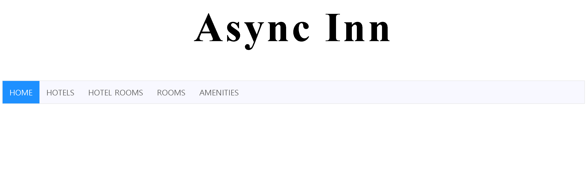

### Async Inn

Create a MVC application for a Hotel management system for the Async Inn. They are currently looking for a full stack web application that will allow them to better manage their assets in their hotels. They are anticipating the ability to modify and manage rooms, amenities, and new hotel locations as they are built. They have turned to you to assist them in persisting their data across a relational database and maintain its integrity as they make changes to the system.

## Load Application
1.	in terminal: git clone https://github.com/mtncrawler/AsyncInn.git  
2.	open AsyncInn.sln
3.	run IIS server  
4.	enjoy the app!  
