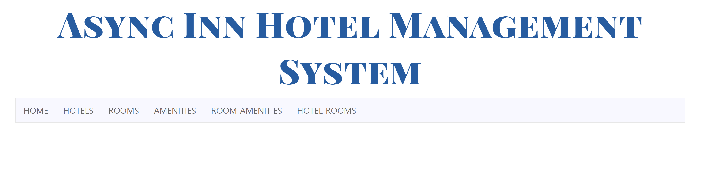

### Async Inn

Create a MVC application for a Hotel management system for the Async Inn. They are currently looking for a full stack web application that will allow them to better manage their assets in their hotels. They are anticipating the ability to modify and manage rooms, amenities, and new hotel locations as they are built. They have turned to you to assist them in persisting their data across a relational database and maintain its integrity as they make changes to the system.  

https://asyncinncf.azurewebsites.net/  

  

## Load Application
1.	in terminal: git clone https://github.com/mtncrawler/AsyncInn.git  
2.	open AsyncInn.sln
3.	run IIS server  
4.	enjoy the app!  

## Database Schema  
  

Hotels: This table holds the hotel name, address, and phone number for all locations. It maintains a primary key ID for each hotel. It is referenced by the primary key in the hotel rooms table.  

Rooms: This table containts the room name, layout, and unique ID as its primary key. The layout references a enum for the three layout types. It is referenced in the hotel rooms and room amenities tables.  

Hotel Rooms: This table contains the hotel ID, room ID, room number, rate, and pet friendly status of all rooms. Its unique identifier is a composite key of the hotel ID and room number. It is referenced by the hotel and room tables.  

Amenities: This table contains the amenity name and unique ID number. It is referenced in the room amenities table.  

Room Amenities: This table contains the which rooms have which amenities. It is referenced by the amenities and room tables.  
